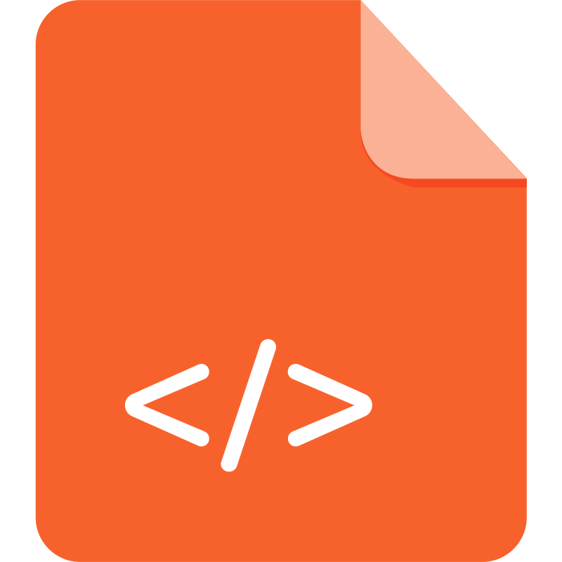

<h1 align="center"> <i> Hi i'm Tashrif Ahmad </i> </h1>

  

### 👨‍🏫 &nbsp; About Me

- 🔭 I’m a passionate Mern Stack Developer.

- 🌱 I’m currently learning **MERN Stack**

- 💬 **I am currently learning MERN Stack. I am passionate about learning Full Stack Web Development and creating a user-friendly and responsive website. So, I spend my precious time learning web frameworks like React js, Node js, Express js and MongoDB. I utilize different  AI tools to learn faster and write better code for a website within less time for better output. I am also consistent with my learning because I believe consistency makes us perfect in our daily work and helps us get a better position.git **
   
   
   
   

* <h3>👨🏽‍💻 &nbsp; My Skills</h3>
       
    

    <table>
      <thead>
        <tr>
          <th></th>
          <th></th>
          <th></th>
          <th></th>
          <th></th>
        </tr>
      </thead>
      <tbody>
        <tr>
          <td>python</td>
          <td>javaScript</td>
          <td>HTML</td>
          <td>CSS</td>
          <td>Tailwind Css</td>
        </tr>
      </tbody>
    </table>
    

  

  <table>
    <thead>
      <tr>
        <th></th>
        <th></th>
        <th></th>
        <th></th>
      </tr>
    </thead>
    <tbody>
      <tr>
        <td>Node.js</td>
        <td>Express.js</td>
        <td>MongoDB</td>
        <td>JSON</td>
      </tr>
    </tbody>
  </table>
  

   

* <h3>👨🏽‍💻 &nbsp; Other Skills</h3>
   
  

  <table>
    <thead>
      <tr>
        <th></th>
        <th></th>
        <th></th>
      </tr>
    </thead>
    <tbody>
      <tr>
        <td>git</td>
        <td>HitHub</td>
        <td>Excel</td>
      </tr>
    </tbody>
  </table>
  

  
